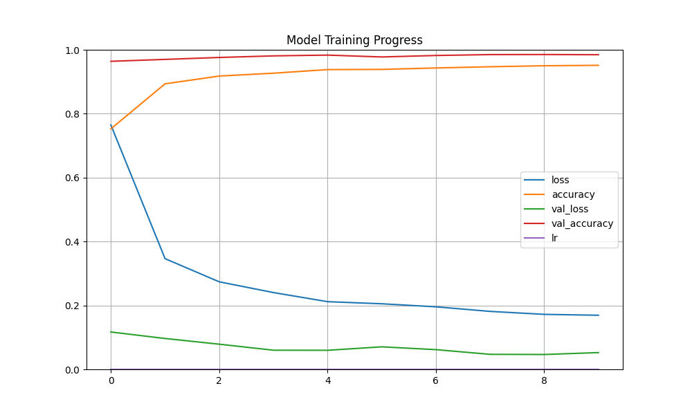

# 🧠 MNIST Yapay Zeka Projesi (CNN + TF.js + Flask)



Canlı çizim ile el yazısı rakam tanıma uygulaması.

> 🎨 Web demo, 🧠 CNN eğitimi, 🌐 Flask REST API ve 🔁 TF.js dönüşümü içerir.

---

## 🔗 Canlı Demo (GitHub Pages)

🎯 [https://furkanzm.github.io/mnist-predict-project/](https://furkanzm.github.io/mnist-predict-project/)

> Bu bağlantıdan `demo.html`'ü tarayıcınızda çalıştırabilirsiniz (TF.js kullanır).

---

## 🔧 Kurulum

```bash
git clone https://github.com/furkanzm/mnist-predict-project.git
cd mnist-predict-project
pip install -r requirements.txt
```

---

## 🚀 Modeli Eğit

```bash
python train.py
```

Model başarıyla eğitildikten sonra:
- `saved_model/` → `.h5` modeli içerir
- `logs/` → TensorBoard logları içerir

---

## 📊 TensorBoard İzleme

```bash
tensorboard --logdir=logs/fit
```

---

## 🧪 Değerlendirme

```bash
python evaluate.py
```

---

## 🌐 Flask API

```bash
python app.py
```

Tarayıcıdan ya da `curl` ile test edebilirsin:
```bash
curl -X POST -F "file=@el_yazisi.png" http://localhost:5000/predict
```

---

## 🖥️ Web Demo (TF.js)

### TF.js dönüşümü:
```bash
bash tfjs_convert.sh
```

### Tarayıcıda demo çalıştır:
```bash
python3 -m http.server
```
Git: [http://localhost:8000/demo.html](http://localhost:8000/demo.html)

---

## 📁 Proje Yapısı

```
mnist_ann_prediction_app/
├── app.py
├── train.py
├── evaluate.py
├── model.py
├── data_loader.py
├── tuner.py
├── data_augmentation.py
├── tfjs_convert.sh
├── demo.html
├── requirements.txt
├── README.md
├── Figure_1.png
├── saved_model/          <-- model çıktısı
├── tfjs_model/           <-- TF.js modeli
└── logs/                 <-- TensorBoard logları
```

---

## 📜 Lisans

MIT © Furkan Üzüm