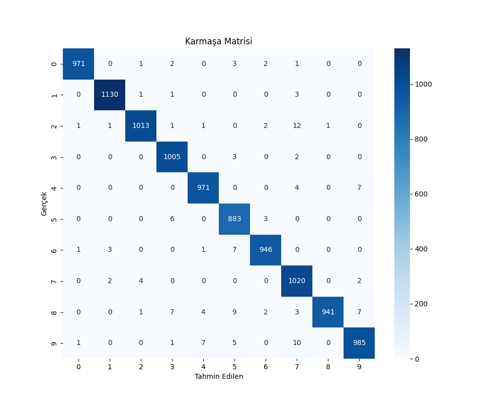

# 🧠 MNIST Yapay Zeka Projesi (CNN + TF.js + Flask)

🎨 Canlı çizim ile el yazısı rakam tanıma uygulaması  
🧠 Kullanıcı seçimine göre 2 farklı model ile tahmin yapılabilir!

---

## 🔗 Canlı Demo (GitHub Pages)

👉 [https://furkanzm.github.io/mnist-predict-project/](https://furkanzm.github.io/mnist-predict-project/)

> Web arayüzünde `Default` ve `Tuned` modeli seçip test edebilirsiniz!

---

## 🧰 Özellikler

- ✅ CNN tabanlı el yazısı tanıma
- ✅ Tuned model (hyperparameter optimization)
- ✅ Flask API (REST)
- ✅ TensorFlow.js dönüşümü
- ✅ Bar grafikli tahmin yüzdeleri
- ✅ Kullanıcı arayüzü üzerinden model seçme imkanı

---

## 🔧 Kurulum

```bash
git clone https://github.com/furkanzm/mnist-predict-project.git
cd mnist-predict-project
pip install -r requirements.txt
```

---

## 🚀 Model Eğitimi

### 1. Varsayılan model (ANN):

```bash
python train.py
```

### 2. Optimize model (Tuned):

```bash
python tuner.py
```

Kaydeder:
- `saved_model/mnist_ann.h5`
- `saved_model/mnist_tuned.h5`

---

## 🔄 TF.js Dönüşüm

```bash
# Default model
bash tfjs_convert.sh

# Tuned model
tensorflowjs_converter --input_format=keras saved_model/mnist_tuned.h5 tfjs_model_tuned/
```

---

## 🌐 Flask API Kullanımı

```bash
python app.py
```

### Tahmin isteği (model seçimi dahil):

```bash
curl -X POST -F "file=@resim.png" http://localhost:5000/predict?model=default
curl -X POST -F "file=@resim.png" http://localhost:5000/predict?model=tuned
```

---

## 📊 TensorBoard Görselleştirme

```bash
tensorboard --logdir=logs/fit
```

---

## 📁 Proje Yapısı

```
mnist_ann_prediction_app/
├── app.py                 # Flask API
├── train.py               # Default model eğitimi
├── tuner.py               # Hyperparameter tuning
├── model.py               # Model oluşturucu
├── demo.html              # Web arayüzü (model seçimi dahil)
├── tfjs_model/            # Default modelin TF.js sürümü
├── tfjs_model_tuned/      # Tuned modelin TF.js sürümü
├── saved_model/           # HDF5 modeller
├── requirements.txt
├── README.md
```

---

## 🧪 Değerlendirme

```bash
python evaluate.py
```

---

## 🏁 Demo Özeti

- 🎨 Canvas ile çizim yap
- 🔘 Model seç (Default veya Tuned)
- 🧠 Tahmin butonuna bas
- 📊 Tahmin yüzdelerini incele

---

### 🔁 Web Arayüzü İçin Dinamik `reshape` İşlemi

Web arayüzünde, modelin giriş boyutuna göre otomatik olarak tensör yeniden şekillendirme yapılır:

```js
const inputShape = model.inputs[0].shape.map(x => x === null ? 1 : x);
const reshaped = inputTensor.reshape(inputShape);
```

> Bu sayede hem CNN (4D `[1, 28, 28, 1]`) hem de ANN (3D `[1, 28, 28]`) modelleri desteklenir.  
> `null` değerler otomatik olarak `1` ile değiştirilir.

---


---
### 🎯 Model Training Progress


### 🎯Confusion Matrix


---

## 📜 Lisans

MIT © Furkan Üzüm